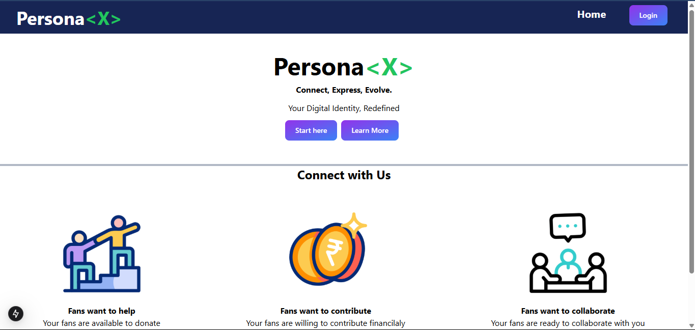
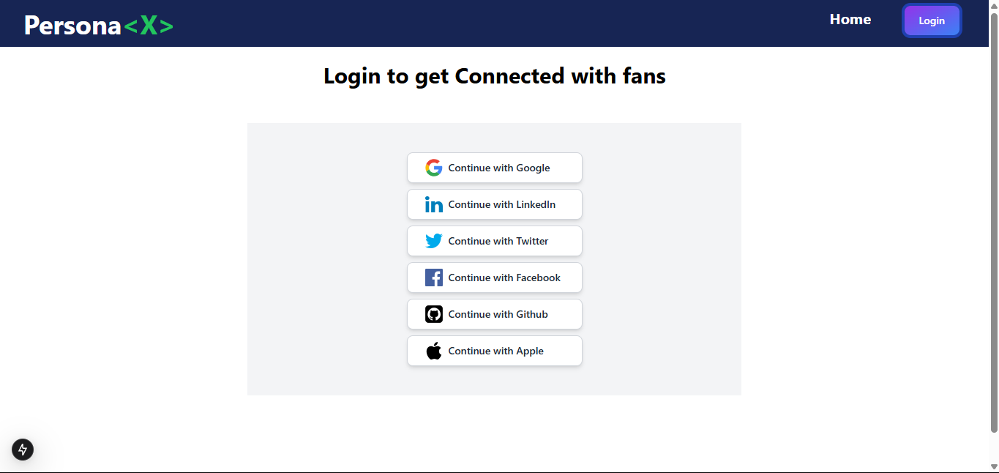
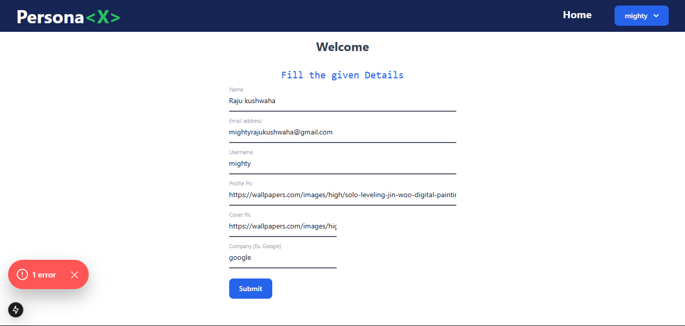

 # 🚀 PersonaX  
**A Next.js-powered futuristic user profile and social interaction platform**  
## 🔹 Overview  
PersonaX is a **modern user profile management** platform built with **Next.js**. It allows users to **customize their profiles**, update their **cover and profile pictures**, and manage their **username and name** through a dynamic dashboard.  

## screenshot 
---
- ## Home Page

- ## Login Page

- ## Dashboard Page

- ## User profile Page


## 🔹 Features  
- 🆔 **Dynamic User Profiles** – Users can update their profile picture, cover photo, username, and name.  
- 🎨 **Customizable UI** – Glassmorphism effects, dark mode, and neon cyberpunk styling.  
- 🤖 **AI-Powered Suggestions** – Smart recommendations for connections and content.  
- 🔐 **Advanced Security** – Multi-factor authentication and encrypted messaging.  
- 📊 **Insights Dashboard** – Track profile views and engagement analytics.  
- 🏆 **Gamification** – Earn badges, achievements, and leaderboard rankings.  
- 📩 **Real-Time Chat & Notifications** – Stay connected with friends and followers.  

## 🔹 Tech Stack  
- **Frontend**: Next.js (React), Tailwind CSS  
- **Backend**: Next.js API Routes (Node.js / Express)  
- **Database**:   MongoDB  
- **Authentication**: NextAuth.js  
- **Storage**: Cloudinary  
- **Deployment**: Vercel  

## 🔹 Installation & Setup  
1. Clone the repository:  
   ```sh
   git clone https://github.com/Raju-kushwaha1230/PersonaX-
   cd PersonaX

2. Install dependencies:`
   ```sh
    npm install
   ```
3. Set up environment variables in a .env.local file:

  ```sh
  DATABASE_URL=your_database_url
  NEXTAUTH_SECRET=your_secret_key
  CLOUDINARY_API_KEY=your_cloudinary_key
  ```
4. Start the development server:

  ```sh
  npm run dev
   ```
🔹 How It Works
Profile Management: Users can update their profile picture, cover image, name, and username via the dashboard.

Data Storage: Profile images and cover photos are stored using Cloudinary or AWS S3.

Authentication: Secure login with NextAuth.js (Google, GitHub, email, etc.).

Real-Time Updates: Changes to profile details reflect instantly.
``` ```
Open [http://localhost:3000](http://localhost:3000) with your browser to see the result.

You can start editing the page by modifying `app/page.js`. The page auto-updates as you edit the file.

This project uses [`next/font`](https://nextjs.org/docs/app/building-your-application/optimizing/fonts) to automatically optimize and load [Geist](https://vercel.com/font), a new font family for Vercel.

## Learn More

To learn more about Next.js, take a look at the following resources:

- [Next.js Documentation](https://nextjs.org/docs) - learn about Next.js features and API.
- [Learn Next.js](https://nextjs.org/learn) - an interactive Next.js tutorial.

You can check out [the Next.js GitHub repository](https://github.com/vercel/next.js) - your feedback and contributions are welcome!

## Deploy on Vercel

The easiest way to deploy your Next.js app is to use the [Vercel Platform](https://vercel.com/new?utm_medium=default-template&filter=next.js&utm_source=create-next-app&utm_campaign=create-next-app-readme) from the creators of Next.js.

Check out our [Next.js deployment documentation](https://nextjs.org/docs/app/building-your-application/deploying) for more details.

---
check the given formate and give the user control and give the requirement 
http://raju.com
